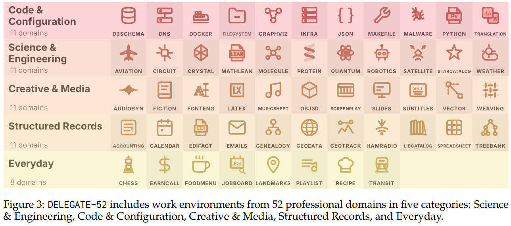
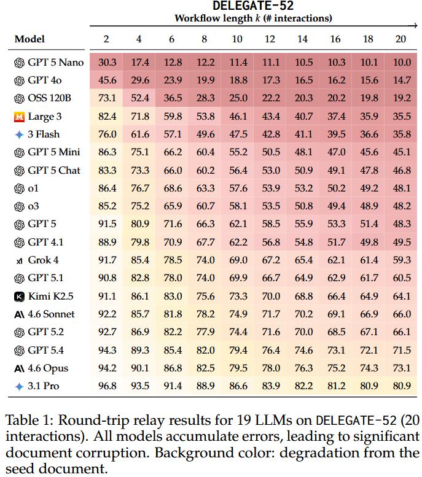

# DELEGATE-52

<p align="center">
  
</p>

## Overview

DELEGATE-52 is a benchmark for evaluating LLMs on long-horizon delegated document editing across 52 professional domains (crystallography files, music notation, accounting ledgers, Python source code, etc.). The repository enables reproduction of experiments from our paper: "[LLMs Corrupt Your Documents When You Delegate](upcoming_link)".

**Dataset:** [microsoft/delegate52 on Hugging Face](https://huggingface.co/datasets/microsoft/delegate52)

## What Can DELEGATE-52 Do?

DELEGATE-52 simulates long-horizon delegated workflows where LLMs edit professional documents on behalf of knowledge workers. The code enables round-trip relay simulations: given a seed document, the LLM performs a structural edit (the "forward" edit), and then a second editing task that undoes that edit (the "backward" edit). Round-trips are chained to simulate long interactions (e.g., 10 round-trips = 20 LLM interactions), and performance is measured by comparing the recovered document against the original using domain-specific evaluators.

The repository includes:

- `run_relay.py`: the main experiment runner that chains multiple round-trip edits per sample and model.
- `run_single.py`: tests individual forward/backward edits in isolation (for quality assurance).
- `model_openai.py`: a standalone OpenAI/Azure OpenAI wrapper for LLM generation.
- `model_agentic.py`: an agentic harness where the LLM uses tools (read/write/delete files, run Python) in a multi-turn loop.
- `domains/`: 52 domain-specific parsers and evaluators. See the [domain viewer](domain_viewer/) for a detailed introduction to each domain.
- `prompts/`: prompt templates used during simulation.

<p align="center">
  
</p>

## Results

<p align="center">
  
</p>

We evaluated 19 LLMs from six families (OpenAI, Anthropic, Google, Mistral, xAI, Moonshot) using the Reconstruction Score (RS@k), which measures document preservation after k interactions via domain-specific similarity functions.

A detailed discussion of our evaluation methods and results can be found in our paper at: [upcoming_link]

## Dataset

The DELEGATE-52 dataset is hosted on Hugging Face: [microsoft/delegate52](https://huggingface.co/datasets/microsoft/delegate52).

It contains 234 work environments across 48 domains (the subset of the full 310 environments whose seed documents permit redistribution). Each environment includes a seed document, 5–10 reversible edit pairs, and distractor context.

The dataset is downloaded automatically when running simulations. You can also load it directly:

```python
from huggingface_hub import hf_hub_download
import json

path = hf_hub_download(repo_id="microsoft/delegate52", filename="delegate52.jsonl", repo_type="dataset")
with open(path) as f:
    samples = [json.loads(line) for line in f]

print(f"{len(samples)} samples across {len(set(s['sample_type'] for s in samples))} domains")
```

## Getting Started

1. Clone the repository:
```sh
git clone https://github.com/microsoft/delegate52.git
cd delegate52
```

2. Install dependencies:
```sh
pip install -r requirements.txt
```

3. Set your API key:
```sh
export OPENAI_API_KEY="your-key-here"
# Or for Azure OpenAI:
export AZURE_OPENAI_API_KEY="your-key-here"
export AZURE_OPENAI_ENDPOINT="your-endpoint-here"
```

4. Run a relay simulation:
```sh
python run_relay.py --model_names gpt-5.4 --domains subtitles --num_round_trips 10
```

The dataset is downloaded from Hugging Face automatically on first run. To use a local copy instead, pass `--input_path path/to/delegate52.jsonl`.

> [!WARNING]
> Running simulations will perform LLM API calls, which will cost real money.

Run with `--help` to see all available parameters, including `--num_workers` for parallelization and `--skip_distractor` to exclude distractor context.

## Contributing

We welcome community contributions to expand and improve DELEGATE-52. You can contribute by:

- **Adding new work environments** to existing domains (new seed documents + edit tasks)
- **Improving edit tasks** for existing environments (adding edits, refining instructions)
- **Improving domain evaluators** (making parsers more robust or scoring more precise)
- **Contributing entirely new domains** (a new document format + parser + evaluator + sample environments)

The best way to get started is to read the Appendix of our paper, which describes the process we followed to create the dataset, including the desiderata for seed documents, the rules for writing edits, and how domain evaluators work. Then, submit a Pull Request to this repository.

This project welcomes contributions and suggestions. Most contributions require you to agree to a Contributor License Agreement (CLA) declaring that you have the right to, and actually do, grant us the rights to use your contribution. For details, visit https://cla.opensource.microsoft.com.

When you submit a pull request, a CLA bot will automatically determine whether you need to provide a CLA and decorate the PR appropriately (e.g., status check, comment). Simply follow the instructions provided by the bot. You will only need to do this once across all repos using our CLA.

This project has adopted the [Microsoft Open Source Code of Conduct](https://opensource.microsoft.com/codeofconduct/). For more information see the [Code of Conduct FAQ](https://opensource.microsoft.com/codeofconduct/faq/) or contact [opencode@microsoft.com](mailto:opencode@microsoft.com) with any additional questions or comments.

## Citation

If you make use of the code, data, or findings, please cite our paper:
```bibtex
@article{laban2026delegate52,
  title={LLMs Corrupt Your Documents When You Delegate},
  author={Laban, Philippe and Schnabel, Tobias and Neville, Jennifer},
  year={2026},
  note={Under review}
}
```

## License

MIT License

Nothing disclosed here, including the Out of Scope Uses section, should be interpreted as or deemed a restriction or modification to the license the code is released under.

---

## Additional Information

### Intended Uses

DELEGATE-52 is best suited for running round-trip relay simulations to evaluate LLMs' ability to faithfully edit professional documents across 52 domains without introducing errors. Users can reproduce results from the paper, test additional LLMs, or extend the benchmark with new domains. It is being shared with the research community to facilitate reproduction and foster further research.

### Out-of-Scope Uses

DELEGATE-52 is not intended to simulate realistic interaction between humans and LLMs, and should not be used to replace human studies or human annotation. The code and findings cannot be used to make claims about humans or real users of the systems. We do not recommend using DELEGATE-52 in commercial or real-world applications without further testing, nor in the context of high-risk decision making (e.g. in law enforcement, legal, finance, or healthcare).

### Limitations

Using DELEGATE-52 requires access to an LLM (API-based or locally-hosted); we do not provide LLM access. The benchmark was designed and tested using the English language. It included experiments with 19 models (both open-weights and API-based); though we expect results to generalize, experiments should be conducted to confirm. There has not been a systematic effort to protect against security vulnerabilities such as indirect prompt injection attacks.

### Best Practices

We recommend experimenting at small scale before proceeding with larger runs. Use `--num_workers` for parallelization, calibrated to your API rate limits. We strongly encourage using LLMs that support robust Responsible AI mitigations, such as [Azure OpenAI](https://learn.microsoft.com/en-us/legal/cognitive-services/openai/overview) services.

### Trademarks

This project may contain trademarks or logos for projects, products, or services. Authorized use of Microsoft trademarks or logos is subject to and must follow [Microsoft's Trademark & Brand Guidelines](https://www.microsoft.com/en-us/legal/intellectualproperty/trademarks/usage/general). Use of Microsoft trademarks or logos in modified versions of this project must not cause confusion or imply Microsoft sponsorship. Any use of third-party trademarks or logos are subject to those third-party's policies.

### Contact

We welcome feedback and collaboration. If you have suggestions, questions, or observe unexpected behavior, please contact us at plaban@microsoft.com.
