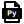
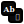
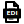

# Domain Viewer

Browse detailed pages for each of the 52 domains in the DELEGATE52 benchmark. Each page includes a domain description, evaluation methodology, and (where available) a seed document excerpt and edit task table from a publicly redistributable sample.

---

### Code & Configuration

| | Domain | Format | Released | Description |
|---|--------|--------|:--------:|-------------|
|  | [Database Schema](dbschema.md) | `.sql` | 6 / 6 | SQL database schemas |
|  | [DNS](dns.md) | `.zone` | 2 / 6 | BIND DNS zone files |
|  | [Docker](docker.md) | `Dockerfile` | 6 / 6 | Dockerfile container builds |
|  | [Filesystem](filesystem.md) | `.txt` | 6 / 6 | File tree listings |
|  | [Graphviz](graphviz.md) | `.dot` | 5 / 6 | DOT graph descriptions |
|  | [Infrastructure](infra.md) | `.tf` | 6 / 6 | Terraform IaC |
|  | [JSON](json.md) | `.json` | 6 / 6 | JSON/YAML structured data |
|  | [Makefile](makefile.md) | `Makefile` | 5 / 6 | GNU Makefile build systems |
|  | [Malware Rules](malware.md) | `.yar` | 6 / 6 | YARA malware rules |
|  | [Python](python.md) | `.py` | 7 / 7 | Python source code |
|  | [Translation](translation.md) | `.po` | 6 / 6 | GNU gettext translations |

### Science & Engineering

| | Domain | Format | Released | Description |
|---|--------|--------|:--------:|-------------|
|  | [Aviation](aviation.md) | `.notam` | 0 / 6 | ICAO NOTAM notices |
|  | [Circuit](circuit.md) | `.cir` | 4 / 6 | SPICE circuit netlists |
|  | [Crystal](crystal.md) | `.cif` | 3 / 6 | CIF crystallographic structures |
|  | [MathLean](mathlean.md) | `.lean` | 6 / 6 | Lean 4 formal proofs |
|  | [Molecule](molecule.md) | `.sdf` | 6 / 6 | SDF molecular structures |
|  | [Protein](protein.md) | `.pdb` | 6 / 6 | PDB protein structures |
|  | [Quantum](quantum.md) | `.qasm` | 6 / 6 | OpenQASM quantum circuits |
|  | [Robotics](robotics.md) | `.urdf` | 3 / 6 | URDF robot descriptions |
|  | [Satellite](satellite.md) | `.tle` | 6 / 6 | TLE satellite orbital data |
|  | [Star Catalog](starcatalog.md) | `.vot` | 6 / 6 | VOTable star catalogs |
|  | [Weather](weather.md) | `.metar` | 6 / 6 | METAR/TAF weather reports |

### Creative & Media

| | Domain | Format | Released | Description |
|---|--------|--------|:--------:|-------------|
|  | [Audio Synthesis](audiosyn.md) | `.csd` | 2 / 6 | CSound audio synthesis |
|  | [Fiction](fiction.md) | `.md` | 0 / 6 | Creative fiction |
|  | [Font Engineering](fonteng.md) | `.fea` | 6 / 6 | OpenType font features |
|  | [LaTeX](latex.md) | `.tex` | 6 / 6 | LaTeX academic documents |
|  | [Music Sheet](musicsheet.md) | `.ly` | 6 / 6 | LilyPond music notation |
|  | [3D Object](obj3d.md) | `.obj` | 6 / 6 | Wavefront OBJ 3D models |
|  | [Screenplay](screenplay.md) | `.fadein` | 6 / 6 | Screenplay scripts |
|  | [Slides](slides.md) | `.md` | 1 / 6 | Presentation slides |
|  | [Subtitles](subtitles.md) | `.srt` | 5 / 6 | SRT subtitle files |
|  | [Vector Graphics](vector.md) | `.svg` | 3 / 6 | SVG vector graphics |
|  | [Weaving](weaving.md) | `.wif` | 0 / 6 | WIF weaving drafts |

### Structured Records

| | Domain | Format | Released | Description |
|---|--------|--------|:--------:|-------------|
|  | [Accounting](accounting.md) | `.ledger` | 6 / 6 | Ledger financial transactions |
|  | [Calendar](calendar.md) | `.ics` | 2 / 5 | iCalendar events |
|  | [EDIFACT](edifact.md) | `.edi` | 4 / 6 | UN/EDIFACT trade messages |
|  | [Emails](emails.md) | `.mbox` | 2 / 5 | Email threads |
|  | [Genealogy](genealogy.md) | `.ged` | 2 / 6 | GEDCOM family trees |
|  | [Geodata](geodata.md) | `.geojson` | 3 / 6 | GeoJSON geographic features |
|  | [Geotrack](geotrack.md) | `.gpx` | 6 / 6 | GPX tracks and waypoints |
|  | [Ham Radio](hamradio.md) | `.adi` | 5 / 6 | ADIF amateur radio logs |
|  | [Library Catalog](libcatalog.md) | `.xml` | 4 / 6 | MARCXML library records |
|  | [Spreadsheet](spreadsheet.md) | `.csv` | 6 / 6 | Tabular CSV data |
|  | [Treebank](treebank.md) | `.conllu` | 6 / 6 | CoNLL-U linguistic treebanks |

### Everyday

| | Domain | Format | Released | Description |
|---|--------|--------|:--------:|-------------|
|  | [Chess](chess.md) | `.pgn` | 5 / 5 | PGN chess games |
|  | [Earnings Call](earncall.md) | `.md` | 6 / 6 | Earnings call transcripts |
|  | [Food Menu](foodmenu.md) | `.yaml` | 6 / 6 | Restaurant menus |
|  | [Job Board](jobboard.md) | `.csv` | 6 / 6 | Job listings |
|  | [Landmarks](landmarks.md) | `.kml` | 6 / 6 | KML geographic placemarks |
|  | [Playlist](playlist.md) | `.xspf` | 0 / 6 | XSPF media playlists |
|  | [Recipe](recipe.md) | `.yaml` | 1 / 6 | Cooking recipes |
|  | [Transit](transit.md) | `.txt` | 4 / 6 | GTFS transit schedules |
